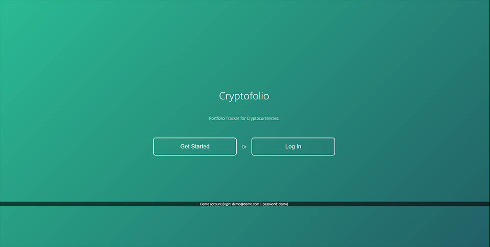
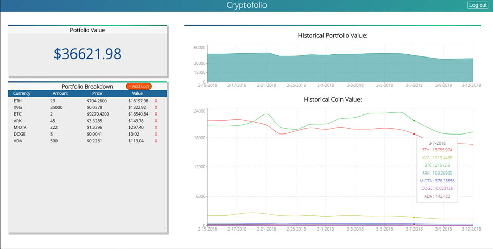

# CryptoFolio
You can see this project live [here](https://laughing-knuth-848bc8.netlify.com/).
### What Does:
CryptoFolio is a portfolio value tracker for cryptocurrencies, it tracks the 100 most popular cryptocurrencies and users can add the coins they own on the dashboard. After adding coins, a chart will show teh historical value of the coins they added and breakdown the total value of their portfolio throughout time.
### What it looks like:

